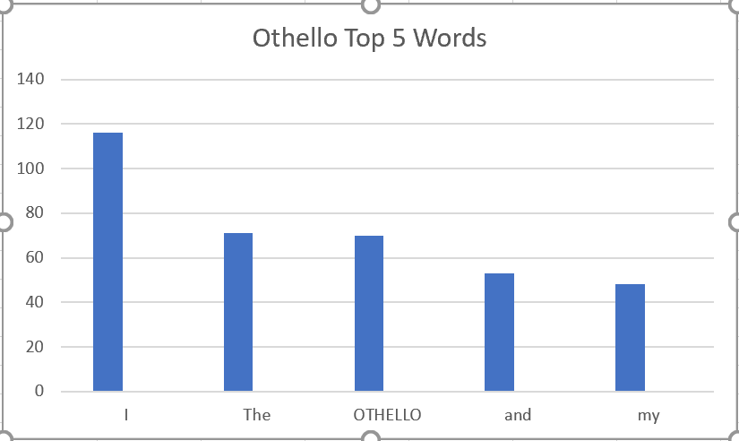

# spark-scala-wordcount
## Links
- [Webpage]()
- [Source](https://github.com/SierraK/spark-scala-wordcount)
## About Me & Objective
My name is Sierra King and I am a student at Northwest Missouri State University. I am currently a junior studying Computer Science.
The objective of this assignment is to find the top five most common words in Shakepeare's Othello, the Moore of Venice Scene II: A bedchamber in the castle.

## Data
I created a .txt file by copying and pasting the text from Othello, the Moore of Venice Scene II: A bedchamber in the castle.
Here is the original website:
- [Othello](http://shakespeare.mit.edu/othello/othello.5.2.html)

## Scala
```
val othello = sc.textFile("C:\tmp\hive\README.txt")
val topWordCount = othello.
  flatMap(str=>str.split(" ")).
  filter(!_.isEmpty).
  map(word=>(word,1)).
  reduceByKey(_+_).
  map{case (word, count) => (count, word)}.
  sortByKey(false)
>topWordCount.
take(5).
foreach(x=>println(x))
```

## Results
The results I got from the Scala commands:

| Count | Word    |
|-------|---------|
| 116   | I       |
| 71    | The     |
| 70    | OTHELLO |
| 53    | and     |
| 48    | my      |


The most frequent word is "I" with a count of 116. "The" recieved a count of 71. "OTHELLO" revieved a count of 70. "and" recieved a count of 53 and lastly "my" recieved a count of 48.

With the data I created this chart:


